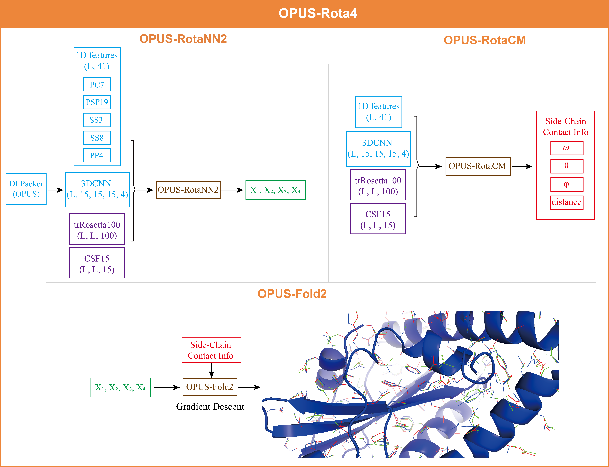

# OPUS-Rota4

Accurate protein side-chain modeling is crucial for protein folding and protein design. In the past decades, many successful methods have been proposed to address this issue. However, most of them depend on the discrete samples from the rotamer library, which may have limitations on their accuracies and usages. In this study, we report an open-source toolkit for protein side-chain modeling, named OPUS-Rota4. It consists of three modules: OPUS-RotaNN2, which predicts protein side-chain dihedral angles; OPUS-RotaCM, which measures the distance and orientation information between the side chain of different residue pairs; and OPUS-Fold2, which applies the constraints derived from the first two modules to guide side-chain modeling. OPUS-Rota4 adopts the dihedral angles predicted by OPUS-RotaNN2 as its initial states, and uses OPUS-Fold2 to refine the side-chain conformation with the side-chain contact map constraints derived from OPUS-RotaCM. Therefore, we convert the side-chain modeling problem into a side-chain contact map prediction problem. OPUS-Fold2 is written in Python and TensorFlow2.4, which is user-friendly to include other differentiable energy terms. OPUS-Rota4 also provides a platform in which the side-chain conformation can be dynamically adjusted under the influence of other processes.

## Framework of OPUS-Rota4



## Usage

### Dependency

```
Python 3.7
TensorFlow 2.4
```

The standalone version of OPUS-Rota4 and the test sets we used can be downloaded directly from [Here](https://ma-lab.rice.edu/dist/opus-rota4.zip). Also, it is hosted on [Baidu Drive](https://pan.baidu.com/s/1Lr0QR9rBQhulTMiQDN37yQ) with password `k90d`.

```
$DOWNLOAD_DIR/                             # Total: ~ 4 GB
    datasets/                              
        # af2_bb_data (AlphaFold2 predicted backbones for CASP14(15))
        # bb_data (Native backbones for CAMEO(60), CASP14(15) and CASPFM(56))
        # data (Native structures for all datasets)
        
    OPUS_RotaNN2_and_RotaCM/
        RotaCM/
          # Codes and pre-trained models for OPUS-RotaCM
        RotaNN2/
          # Codes and pre-trained models for OPUS_RotaNN2
          DLPacker_OPUS/
            # Codes and pre-trained models for DLPacker(OPUS)
          mkinputs/
            # Codes for calculating input features

    OPUS-Fold2/
        # Codes for OPUS-Fold2
```

## Results

#### The performance of different side-chain modeling methods on three native backbone test sets measured by all residues

#### CAMEO(60)
| |MAE(χ1)|MAE(χ2)|MAE(χ3)|MAE(χ4)|ACC|
|:----:|:----:|:----:|:----:|:----:|:----:|
|FASPR |	29.15 |	33.03 |	49.74 |	57.93 |	52.13%|
|SCWRL4 |	29.01 |	33.37 |	49.84 |	57.17 |	52.66%|
|OSCAR-star|	27.29 |	33.11 	|48.64 |	57.66 |	52.81%|
|DLPacker|	24.11 |	30.55| 	50.05 	|68.10 |	55.99%|
|OPUS-RotaNN2|	21.61 |	27.01 |	42.30 |	47.78 |	56.86%|
|OPUS-Rota4|	**21.34** |	**27.01** |	**42.30** 	|**47.78** |**58.66%**|

#### CASPFM(56)
| |MAE(χ1)|MAE(χ2)|MAE(χ3)|MAE(χ4)|ACC|
|:----:|:----:|:----:|:----:|:----:|:----:|
|FASPR |	26.63 |	30.80 |	48.62 |	54.81 |	56.28%|
|SCWRL4 |	27.09| 	31.40 |	47.69 |	54.61 |	56.40%|
|OSCAR-star	|24.53| 29.40 |	45.70 |	52.99 |	57.79%|
|DLPacker|	21.35| 	28.88 |	48.85 |	66.78 |	58.78%|
|OPUS-RotaNN2|	18.85 |	25.70 |	39.82 |	44.87 	|58.99%|
|OPUS-Rota4|	**18.46** |	**25.70** 	|**39.82** |	**44.87** 	|**61.27%**|

#### CASP14(15)
| |MAE(χ1)|MAE(χ2)|MAE(χ3)|MAE(χ4)|ACC|
|:----:|:----:|:----:|:----:|:----:|:----:|
|FASPR| 	35.80 |38.03 |	49.50 |	45.19 |	39.58%|
|SCWRL4 |	35.27 |	37.23 |	51.58 |	48.15 |	40.09%|
|OSCAR-star|	34.45 |38.44 |	48.95 |	42.28 |	40.09%|
|DLPacker|	30.99 	|38.40| 	53.95 |	70.83 	|43.15%|
|OPUS-RotaNN2	|**28.21** 	|34.21 	|45.33 |	40.76 |	43.01%|
|OPUS-Rota4|	28.33 |	**34.21** |	**45.33** |	**40.76** |	**45.23%**|

#### The RMSD results of different side-chain modeling methods on non-native backbone test set  CASP14-AF2 (15)

|	|RMSD(All)	|P-value	|RMSD(Core)|	P-value|
|:----:|:----:|:----:|:----:|:----:|
|AlphaFold2	|**0.421** |	5.9E-05|	**0.293** |	0.08 |
|FASPR| 	0.457 |	8.9E-06	|0.328 |	6.3E-03|
|SCWRL4 |	0.462 |	4.2E-08|	0.330 	|4.5E-03|
|OSCAR-star|0.453 |	1.2E-04|	0.337 |	1.1E-03|
|DLPacker|0.448 |	6.0E-04	|0.322 |	6.1E-03|
|OPUS-Rota4|	0.438 |	-|0.304 |	-|


## Useful Tools

### OPUS-RotaNN

[OPUS-RotaNN](https://github.com/thuxugang/opus_rota3)

### OPUS-X

[OPUS-X](https://github.com/thuxugang/opus_x)

### DLPacker

[DLPacker](https://github.com/nekitmm/DLPacker)


## Run OPUS_RotaNN2_and_RotaCM

Use `run_opus_rota4.py` to generate the results of OPUS-RotaNN2 (\*.rotann2) and OPUS-RotaCM (\*.rotacm.npz).


## Run OPUS-Fold2

Use `run_opus_fold2.py` to generate the optimized results of OPUS-Rota4 (\*.rota4) and (\*.pdb).

## Availability 
This project is freely available for academic usage only.

## Reference 
```bibtex
@article{xu2021opus2,
  title={OPUS-Rota4: A Gradient-Based Protein Side-Chain Modeling Framework Assisted by Deep Learning-Based Predictors},
  author={Xu, Gang and Wang, Qinghua and Ma, Jianpeng},
  journal={Briefings in Bioinformatics},
  year={2021},
  publisher={Oxford University Press}
}
```
